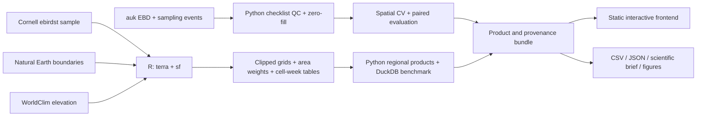

# BirdScope — eBird Conservation Workbench

**Reproducible bird abundance, population trends, and checklist model evaluation using official eBird sample datasets.**

BirdScope turns official eBird sample data into geospatial analyses, regional biological data products, a model comparison, standalone scientific figures, and an interactive frontend. The dashboard uses a minimal © BirdScope wordmark, an eBird-inspired forest-green palette, and sidebar navigation across five analysis views.

The underlying observations and published model estimates are real. The analysis code and derived products are this project’s contribution. The sample datasets support regional exploration and a small checklist modeling experiment; they do not reproduce Cornell’s production models or establish performance at full eBird scale. No simulated biological values are used in the dashboard.

## Explore the project

1. Open the dashboard locally (instructions below). Start at **Species explorer**, then **Population trends**, **Experiment lab**, and **Data products**.
2. Read the [dashboard handbook](docs/DASHBOARD_HANDBOOK.md) — a view-by-view explanation of every concept, number, model and caveat on screen, and how the pipeline produces each one.
3. Read the [architecture decisions](docs/ARCHITECTURE.md) and [scientific methods](docs/METHODS.md).
4. Use the [review checklist](docs/REVIEW.md) to verify the build and reproduce the acceptance steps.

### Open the already-built frontend — no installations or API keys

From this repository:

```bash
python3 -m http.server 4173 --bind 127.0.0.1 --directory dist
```

Open **http://127.0.0.1:4173**. The committed `dist/` includes the frontend and computed sample products. It uses standard browser ES modules and locally stored maps, styles, and data; it has no CDN dependencies. After starting the server, the local demo works without internet access. External source links require internet.

Do not open `index.html` by double-clicking: browsers restrict JSON fetches from `file://`.

The installed local environment also supports `make serve`. Stop the server with Ctrl+C.

### Recompute everything from the downloaded source data

This workspace already contains an environment and the downloaded samples:

```bash
make pipeline
make test
```

`make pipeline` runs R geospatial processing, Python analyses, exports, provenance, and R figure rendering. Its results replace the generated products; avoid running two pipeline jobs in the same checkout.

### Set up on a new computer

Prerequisites: **Python 3.9–3.12, R 4.5.2, and Node 22+**. Node is needed only for JavaScript tests. The frontend itself has no build step. The recorded run used Python 3.9.6, R 4.5.2, and Node 25.8.1 on macOS.

```bash
make setup       # isolated .venv and project-local .R-library
make fetch       # official public teaching samples; no eBird key needed
make pipeline
make test
make serve
```

Python versions are pinned in [requirements.txt](requirements.txt). The R dependency graph is pinned in [renv.lock](renv.lock), restored by `scripts/setup_R.R`. The supplied workspace’s `.venv` reused preinstalled system packages at those Python versions; the new-machine setup creates an isolated environment. A clean Linux installation has not been executed here. Compiling `sf`, `terra`, `units`, or `arrow` on a machine without binaries can require GDAL, GEOS, PROJ, UDUNITS2, a C++ toolchain, and additional build time. The committed dashboard can be served without installing these analysis dependencies.

After the initial download, `make pipeline` is offline. `make reproduce` combines fetch, computation and tests. Raw downloads are not committed; acquisition on another machine needs internet.

## The scientific questions

### Michigan: interpreting published Status and Trends products

> How does modeled Yellow-bellied Sapsucker relative abundance change across the annual cycle, and how do its breeding trends differ across broad regions of Michigan?

The case study uses Cornell’s **`yebsap-example`** dataset. It provides real published products at 27 km resolution. Status estimates describe the **2023 annual cycle**; Trends estimates describe **breeding-season change over 2012–2022**, from the **2022 Trends release**. They are different products and are never treated as interchangeable measurements.

Three latitude bands demonstrate a custom spatial request:

| Region | Definition |
|---|---|
| Northern band | Michigan north of 45.5°N |
| Central band | Michigan between 44°N and 45.5°N |
| Southern band | Michigan south of 44°N |

These are deliberately simple **analytical bands**, not official ecological regions or management recommendations. Generalized Natural Earth boundaries and modeled cell support define the footprint. Supported area is **not** occupied habitat or Michigan’s land area; no terrestrial habitat mask is applied.

### Singapore: evaluating a proposed feature set

> On a small observational sample, does adding spatial and seasonal information improve predictions of Collared Kingfisher detection beyond recorded observation effort?

The official `auk` zero-filling examples contain **Singapore checklists from 2012**. This separate analysis demonstrates the handling of observational data and experiment design. **It is not an independent validation of Cornell’s Michigan models.** It is not appropriate to join these two samples by location, species or year.

## What we accomplished

| Deliverable | Implemented result |
|---|---|
| Real biodiversity inputs | Official `ebirdst` Status and Trends sample; paired `auk` observations and sampling events |
| Raster and vector processing | Crop before materialization; cell polygons; equal-area intersections; GeoTIFF and GeoPackage outputs |
| Environmental integration | Actual WorldClim 2.1 SRTM-derived elevation averaged onto the Status grid |
| Exploratory analysis | 52-week annual cycle, regional comparisons, occurrence and elevation map layers |
| Applied population analysis | Abundance-and-area-weighted regional breeding trends with source ensemble uncertainty |
| Data quality | Effort limits, complete-checklist denominator, shared-visit handling, presence-only count handling, schema and integrity checks |
| Experiment | Three prespecified prediction candidates, five spatial folds, calibration, proper scoring rules, paired spatial-block bootstrap |
| Custom products | Region/season CSV or JSON exports, provenance, conservation brief, standalone figures |
| Reproducibility | Fixed seed, pinned dependencies, raw-input SHA-256 lock, code fingerprints, run manifest |
| Performance | Measured small-data pandas / DuckDB aggregation benchmark with equivalent-result assertion |
| Frontend | Five responsive views, real map cells, interactive timeline, cell inspector, working exports |
| Software practice | Modular analysis code, 23 automated checks, CI configuration, local Git repository, documented review checklist |
| Scaling handoff | Bounded AOI raster processing, Parquet output, SLURM submission template, explicit production roadmap |

## Actual results from the recorded run

The exact metrics, software versions and timestamps are generated in [the manifest](dist/downloads/provenance.json); elapsed times vary across machines and runs.

### Published product analysis

- **293** supported Status cells × **52** weeks = **15,236** cell-week records.
- **156** distinct Trends cells, summarized from **100** source ensemble replicates each. The Status and Trends cell counts differ because their grids and support differ.
- The Michigan area-weighted annual-cycle maximum occurs in the week of **April 19**, at approximately **0.649** relative abundance units.
- The supported Michigan breeding trend is approximately **−0.84% per year**, with an **80% ensemble interval of −1.06% to −0.20%**.
- The northern band is approximately **−1.20% per year**, with an interval excluding zero. The central and southern bands’ intervals include zero.

These are summaries of Cornell’s teaching subset under our explicit regional weighting and boundary choices. They are **not Cornell’s official statewide published statistics**. A spring seasonal peak does not itself imply population growth or decline.

### Observational experiment

- **729** source sampling events and **283** species records across the three kingfisher species included in the extract.
- **204** eligible independent visits after the configured filters.
- **67** Collared Kingfisher detections and **137** complete-checklist non-detections.
- **23** spatial groups after merging blocks connected by repeated locality IDs.
- **6** eligible presence-only “X” counts retained as detections, with abundance counts left unknown.

| Candidate | Out-of-fold Brier score ↓ | Out-of-fold ROC AUC ↑ |
|---|---:|---:|
| Training-fold prevalence | 0.2282 | 0.356 |
| Effort-only logistic regression | 0.2293 | 0.553 |
| Effort + space + season | 0.2351 | 0.545 |

The paired Brier-score change for the added feature set is approximately **+0.0059**, with a **95% block-bootstrap interval of −0.0089 to +0.0216**. Lower Brier is better. The added features do **not** establish an improvement in this sample. Training prevalence has the lowest point-estimate Brier score.

The prevalence baseline uses a different training prevalence in each fold; therefore its pooled out-of-fold AUC need not equal 0.5. No candidate was tuned after looking at these test-fold results.

## Frontend guide

| View | What you can do | What changes the result |
|---|---|---|
| Species explorer | Inspect map cells, move or animate the timeline, switch abundance/occurrence/elevation layers | Region changes weighted summaries; week changes cell values; seasons jump to the first matching source week |
| Population trends | Inspect cell estimates and regional forest plot | Region changes the aggregate; no annual-cycle slider is applied to long-term trends |
| Experiment lab | Examine sample filtering, candidate scores, calibration and comparison interval | Read-only display of the reproducible experiment |
| Data products | Select region, weekly/trend product, season and CSV/JSON; preview and download | Filters operate on completed computed summaries |
| Methods & lineage | Read assumptions, dependencies, source links and benchmark context | Links to the full manifest and external primary sources |

The dashboard performs no model training in the browser. It provides a small, reproducible delivery layer over completed scientific computations. Its static deployment does not expose raw checklist rows, observer IDs, user credentials, or an unauthenticated job runner.

## Architecture



**R owns scientific spatial access and geometry.** `ebirdst` is the provider’s official interface; `terra` reads and crops raster data; `sf` performs spatial intersections and writes GIS products. This keeps eBird access semantics close to their source.

**Python owns experimental evaluation, tabular products and orchestration.** Functions have small, testable scientific contracts. pandas is convenient at this scale; DuckDB demonstrates a file-backed Parquet aggregation with numerical equivalence to the pandas result.

**The frontend is dependency-free HTML/CSS/JavaScript.** It uses real GeoJSON geometry and SVG charts. No framework, tile server, map API key, application database or continuously running Python backend is required. This keeps the dashboard portable and usable offline. The map projection is a simple local equirectangular display with longitude scaled at 45°N; scientific area calculations happen upstream in equal-area coordinates.

**Published products and observational experiments stay separate.** Their target quantities, sampling processes, releases, spatial grids and limitations differ. A shared interface does not justify merging them into one training table.

**Compute and delivery are separate deployment concerns.** R/Python can move to a scheduler or HPC environment without changing the frontend. A production service could publish a validated versioned product bundle to object storage. Browser clients should not load entire EBD files or execute geospatial workloads in a small web runtime.

See [ARCHITECTURE.md](docs/ARCHITECTURE.md) for alternatives, tradeoffs, caching, security, scalability and failure behavior.

## How the pipeline works

1. **Acquire.** `scripts/fetch_data.R` downloads the `ebirdst` example, the paired `auk` files, Natural Earth boundaries, and WorldClim elevation. Full species downloads are a different access workflow and require an approved key.
2. **Verify inputs.** `pipeline.py` compares downloaded inputs against `data/manifest.lock.json`. Missing or changed inputs fail explicitly rather than silently updating the scientific dataset.
3. **Crop and align.** `scripts/spatial.R` verifies the eBird release against configuration, crops the 52-band raster before reading arrays, checks grid alignment, and preserves zeros and missing values.
4. **Build regional weights.** Native cells are intersected with the Michigan geometry and analytical bands in EPSG:8857. Every partial cell receives its actual regional intersection area. Trends use their own native grid before transformation.
5. **Integrate elevation.** The coarse SRTM-derived elevation raster is cropped and reprojected using average resampling to the Status grid. It is an example covariate, not a habitat effect estimate.
6. **Summarize published models.** Weekly means use area weights. Regional trends use abundance × area within each source ensemble replicate, followed by replicate-level quantiles.
7. **Prepare observations.** Restrict to complete stationary/traveling checklists and effort limits; collapse shared visits; union accepted detections across group members; create non-detections only within the eligible complete-checklist denominator.
8. **Evaluate features.** Prespecified candidates receive identical spatial folds. Transformations fit within training folds. Produce out-of-fold Brier, AUC, average precision, log loss, calibration bins and a paired spatial-block bootstrap.
9. **Benchmark.** Run equivalent weighted aggregations through pandas and DuckDB five times. Compare numerical outputs; record times and Parquet size. This is not a throughput benchmark on production-scale data.
10. **Deliver.** Write public derived summaries, local GIS products, local private checklist outputs, a provenance manifest, a conservation brief, and two standalone scientific figures.

Run with `--skip-spatial` only to reuse spatial products whose source/data/config fingerprint matches. The normal command recomputes them. On failure the command exits nonzero; publishing is a separate operation and must follow successful checks. The current multi-file output directory is **not a transactional product store**.

## Scientific methods at a glance

For region `R` and week `t`, with modeled cell value `a_it` and regional overlap area `A_iR`:

```text
regional_abundance_Rt = sum(a_it * A_iR) / sum(A_iR)
```

The denominator includes only finite supported values for that week. Zero values stay in the denominator. `supported_area_km2` and `support_fraction` accompany the result.

For source trend replicate `b`, with annual percent trend `g_ib` and midpoint relative abundance `n_ib`:

```text
regional_trend_Rb = sum(g_ib * n_ib * A_iR) / sum(n_ib * A_iR)
regional_estimate = median(regional_trend_Rb over b)
regional_interval = quantiles(regional_trend_Rb, 0.10 and 0.90)
```

This is an abundance-weighted mean of cell-level percent-per-year trends, extended with fractional regional area. It is not a new fitted regional population trajectory. The trend documentation’s weighting logic is retained; boundary intersections make partial-cell contributions explicit.

The complete derivation, observational filtering rules, uncertainty interpretation, experimental design and remaining biases are documented in [METHODS.md](docs/METHODS.md).

## Files and outputs

```text
config/analysis.json          Species, releases, thresholds, regions, seed
data/manifest.lock.json       SHA-256 of downloaded biological/environmental inputs
data/raw/                    Downloaded source data (local; ignored by Git)
src/fieldwork/
  checklists.py              Eligible denominator, shared visits, zero-fill, spatial groups
  evaluation.py              Prespecified models, spatial CV, scores, calibration, bootstrap
  products.py                Weighted weekly and ensemble trend summaries
  pipeline.py                Orchestration, integrity, benchmark, bundle, brief, lineage
scripts/
  setup_R.R                  Restore R lock to a project-local library
  fetch_data.R               Official sample acquisition
  spatial.R                  Raster/vector processing and GIS exports
  figures.R                  Standalone scientific plots from exported summaries
  run_pipeline.py            Entry point without local package installation
dist/                        Authored static frontend + generated shareable products
  app.js / lib.js / styles.css
  data/                      Derived map objects, regional summaries and evaluation
  downloads/                 Brief, CSVs, manifest, model evaluation and figures
outputs/                     Local reproducible intermediate and GIS outputs (ignored)
  spatial/                   GeoTIFF, GeoPackage, cell/weight tables, trend replicates
  private/                   Checklist table and out-of-fold predictions; never hosted
  cell_week.parquet          Compressed analytical table
  regional-trend-folds.csv   Regional estimate per source replicate
  run.json                   Local run manifest
tests/                       Scientific and frontend contracts
.github/workflows/checks.yml  CI checks; source downloads not required
hpc/analysis.slurm           Single-job cluster submission template
docs/                        Dashboard handbook, methods, architecture and review guide
```

Useful artifacts:

- [Conservation brief](dist/downloads/conservation-brief.html)
- [Weekly regional data](dist/downloads/weekly-regions.csv)
- [Regional trends and intervals](dist/downloads/regional-trends.csv)
- [Model evaluation](dist/downloads/model-evaluation.json)
- [Run manifest](dist/downloads/provenance.json)
- [Annual-cycle figure](dist/downloads/figures/annual-cycle.png)
- [Regional-trend figure](dist/downloads/figures/regional-trends.png)

## Validation and collaboration

`make test` runs **18 Python scientific/data-contract checks and 5 JavaScript checks**, followed by JavaScript syntax validation. Tests address failure modes, including retained biological zeros, missing support, shared-visit double-counting, incorrect handling of “X”, duplicate source rows, spatial leakage, paired ensemble cancellation, region reconstruction and product filtering.

Local execution of the R and Python pipeline succeeded. The local HTTP server returned 200. Browser-level interaction and visual QA were not executed because this session had no connected browser. The [manual acceptance checklist](docs/REVIEW.md) describes the remaining browser checks. The CI workflow is supplied but has not run on a GitHub-hosted runner. The SLURM template is supplied but has not been submitted to a cluster.

Review methodology changes separately from visual changes. Re-run scientific checks after changing a denominator, mask, split or weighting convention. Do not bless a changed input checksum before checking the source version and downstream effects. Keep raw/private data outside pull requests.

## Taking this to the real project

The built-in study is intentionally fixed to one official sample. The current frontend embeds that study’s species, dates and source labels; changing only `config/analysis.json` does **not** create a generic multi-species application.

To adapt to a real collaborator request:

1. Agree on the ecological estimand, species, years, AOI, effort criteria, uncertainty requirements and permitted use with the science product manager.
2. Obtain authorized EBD/sampling-event extracts and/or Status and Trends access using the provider’s approved workflow. Never commit access keys.
3. Replace the demo AOIs with reviewed geometries; preserve their CRS and version. Validate data coverage before extracting products.
4. Implement a parameterized per-job output directory, species metadata and schema. Add new fixtures for the real source schemas and taxonomy.
5. For EBD scale, filter at the file/partition level first (`auk`/AWK or equivalent streaming processing); do not use this teaching script’s `read_csv` on a multi-billion-record file.
6. Add independent temporal/spatial validation, appropriate buffers, observer treatment and monitoring. Test performance on representative production partitions before estimating capacity.
7. Publish a version only after checks and scientific review. Define product owners, acceptance criteria, refresh cadence, runbooks and retention.

Operational monitoring, distributed ingestion, scheduler integration, automatic stakeholder delivery and production authentication remain future work.

## Acknowledgements

The documentation and frontend in this repository were prepared with the help of Claude Code running Opus 5. The scientific decisions, data sources, and interpretations are my own.

## Data sources, attribution and reuse

- **Status:** Fink et al., eBird Status and Trends, data version 2023; released 2025. Cornell Lab of Ornithology. [DOI: 10.2173/WZTW8903](https://doi.org/10.2173/WZTW8903).
- **Trends:** Fink et al., eBird Status and Trends, data version 2022; released 2023. Cornell Lab of Ornithology. [DOI: 10.2173/ebirdst.2022](https://doi.org/10.2173/ebirdst.2022).
- [`ebirdst` package and official sample](https://ebird.github.io/ebirdst/), including [Status](https://ebird.github.io/ebirdst/articles/status.html), [Trends](https://ebird.github.io/ebirdst/articles/trends.html), and [download documentation](https://ebird.github.io/ebirdst/reference/ebirdst_download_status.html).
- [`auk` official zero-filling examples](https://github.com/CornellLabofOrnithology/auk/tree/main/inst/extdata), acquired with source checksums; observational sample geography is Singapore.
- [WorldClim 2.1 elevation](https://www.worldclim.org/data/worldclim21.html). Fick & Hijmans (2017), *International Journal of Climatology*, 37:4302–4315. SRTM-derived static elevation, 10 arc-minute product.
- [Natural Earth](https://www.naturalearthdata.com/about/terms-of-use/): public-domain administrative context boundaries.

Upstream biological data remain subject to their provider terms; a software license does not relicense those inputs. Raw downloads and observational microdata are excluded from source control and hosting. Review the [eBird data access terms](https://www.birds.cornell.edu/home/ebird-data-access-terms-of-use/) and applicable Status and Trends terms before any wider reuse. This project is independent and is not endorsed by Cornell, CAPS or eBird.

Project-authored code is MIT licensed; see [LICENSE](LICENSE). Attribution for upstream products remains required.
